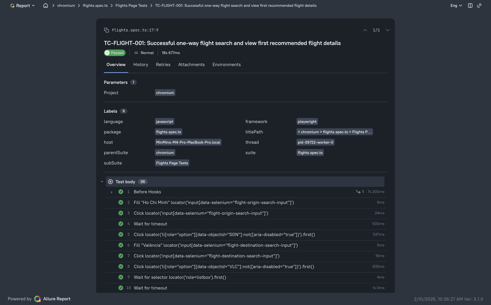
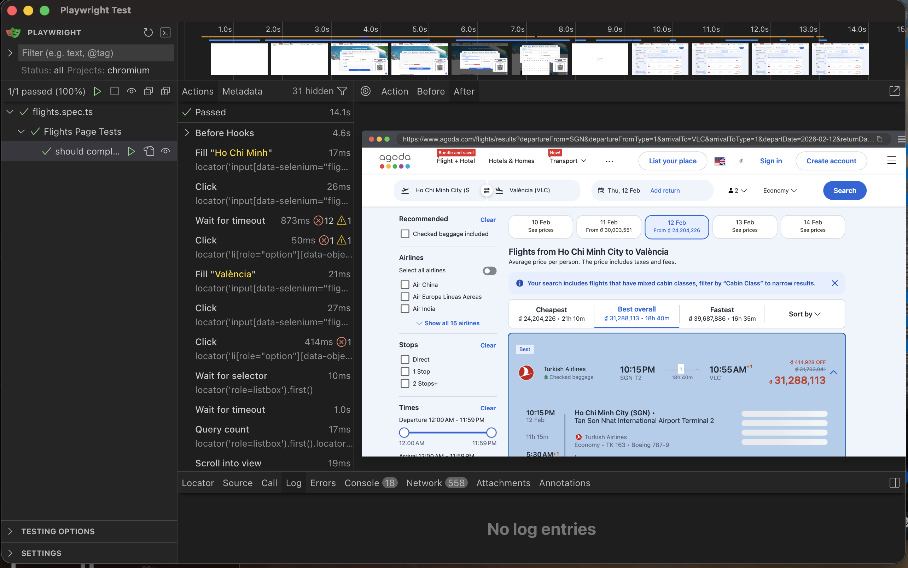

# Set up
1. `npm i` to install required modules.

2. Add file `.env` 
```
BASE_URL=https://www.agoda.com
BROWSER=chromium
```

3. Fast run with command
```
npm run test:flights
```

4. After run the command line above, test is run successfully and report is generated. To open it, run
```
npm run report:open
```



4. Run with PlayWright UI mode

```
npx playwright test tests/flights.spec.ts --ui
```



# Flight Search Test Cases

## Scenario
User searches for a **one-way flight**: From **Ho Chi Minh City (SGN)** To **Valencia (VLC)** \
Departure date = **today + 2 days** \
**2 adults**, **economy class**. 

After clicking **Search**, the user views the **first available flight** in the default **Best overall** tab and verifies that price and flight details are displayed.

Homepage: https://www.agoda.com/

## Test Cases

| Test Case ID   | Title                                           | Type                  | Preconditions                          | Test Steps                                                                 | Expected Result                                                                 |
|----------------|-------------------------------------------------|-----------------------|----------------------------------------|----------------------------------------------------------------------------|---------------------------------------------------------------------------------|
| TC-FLIGHT-001 | Successful one-way flight search and view first recommended flight details | Positive             | - Browser open<br>- On https://www.agoda.com/<br>- Internet available<br>- Flight search functional | 1. Go to Flights tab<br>2. Select **One-way**<br>3. From: Enter "Hồ Chí Minh" or "SGN" → select **Ho Chi Minh City (SGN)**<br>4. To: Enter "València" or "VLC" → select **Valencia (VLC)**<br>5. Select departure date = **today + 2 days**<br>6. Set passengers: **2 Adults**, 0 Children, 0 Infants<br>7. Select **Economy** class<br>8. Click **Search**<br>9. Wait for results page<br>10. Confirm default tab is **Best/Best overall**<br>11. Click the **first flight** in the list | - Search completes, results page loads<br>- At least one flight shown<br>- Default tab is Best overall<br>- Flight details page shows:<br> • Total price<br> • Airline(s), flight number(s), times, duration, stops, airports<br> • Passenger breakdown (2 adults, economy)<br> • No errors |
